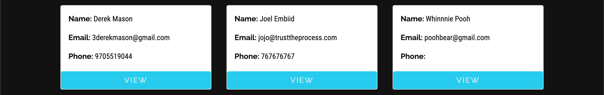
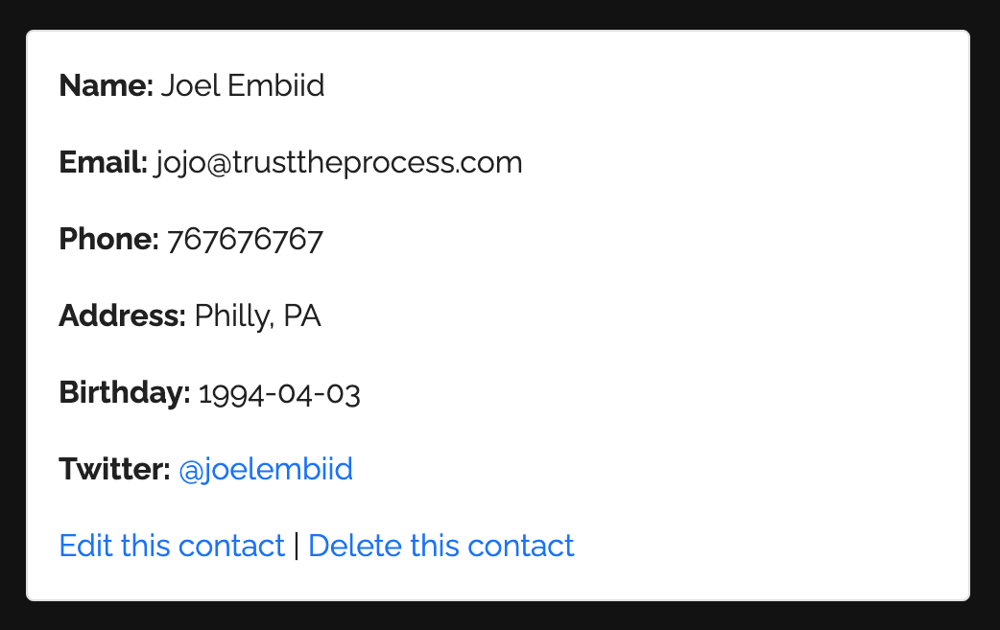

# Address Book _w/ Rails_

## Overview

##### Ruby version 3.0

A simple address book for storing contacts.

---

Add new contacts, updated existing fields, remove contacts... All the things you'd need to keep track of the people in your life!

- Your contacts will be shown by default:

  

- View any contact (or scroll down on each card) to see more info

  

---

### Coming soon...

- User features and authorization (you dont want anyone to have access to your contacts...)

- Obviously a lot more spiffing up the UI!

- Deployment
